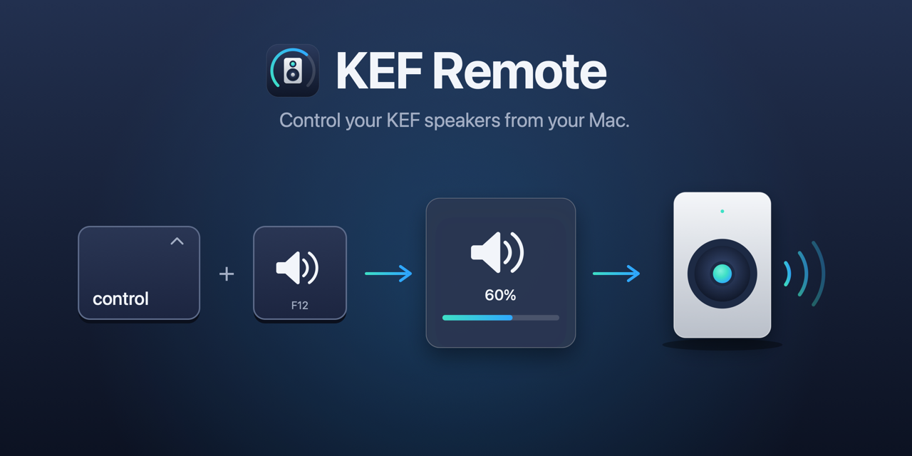
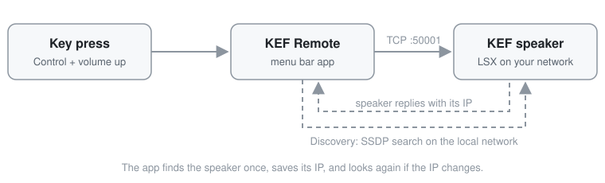

# KEF Remote

KEF already has an app, but I built this one to put my speaker on my keyboard. That matters most if you listen over optical for hi-res audio, like I do: the Mac's volume keys can't reach the speaker over optical, so it's back to the clunky remote. If you use AirPlay, the Mac's own volume already works.

KEF Remote is a small macOS app for the KEF LSX. Hold Control and press the volume keys, and the speaker's volume changes instead of the Mac's, with an on-screen display like the one macOS shows for its own volume. Cmd+Shift+O turns the speaker on, or off if it's on, and can switch it to optical as it does.



It runs in the background with no Dock icon, except while one of its windows is open. A small speaker icon in the menu bar shows whether it's connected to the speaker, and opens Settings.

This is an early release with real rough edges. Read [Known limitations](#known-limitations) before you install it.

## Requirements

- macOS 14 (Sonoma) or later.
- A KEF LSX on the same network as your Mac.
- Accessibility permission, so the app can see the volume keys.
- On macOS 15 and later, Local Network permission, so the app can find the speaker.

I've only tested it on an original LSX. The LS50 Wireless uses the same control protocol, so it may work, but I haven't tried one. Newer models such as the LSX II and LS50 Wireless II use a different control system and aren't supported.

## Install

Upgrading from 0.1.0? Read [Upgrading from 0.1.0](#upgrading-from-010) first.

### 1. Download

Download the zip from the [Releases](https://github.com/dileeparanawake/kef-remote/releases) page, unzip it by double-clicking it in Finder, and move `KEFRemote.app` to your Applications folder.

### 2. Open it the first time

macOS blocks the first open, because Apple hasn't checked (notarized) the app.

#### macOS 15 (Sequoia) and later

1. Open `KEFRemote.app`. macOS says it wasn't opened. Click Done.
2. Open System Settings > Privacy & Security and scroll down to Security.
3. Click Open Anyway. It only shows for about an hour after the blocked open.
4. Enter your password, then click Open.

#### macOS 14 (Sonoma)

Control-click `KEFRemote.app` in Finder, choose Open, then click Open.

#### Any version, from Terminal

Remove the quarantine flag macOS adds to downloads, and it opens normally:

```sh
xattr -dr com.apple.quarantine /Applications/KEFRemote.app
```

You only need to do this once. If it says "No such xattr", the flag is already gone.

### 3. Follow the setup window

When it opens, KEF Remote shows a setup window with three steps.

1. **Permissions.** Each permission has a button that opens System Settings, and gets a tick once it's allowed. Click Continue when both are ticked, or Skip for now.
   - **Accessibility**, so the volume keys reach the speaker. Click Open Settings, then turn on KEFRemote. On macOS 27 this list is called Device Control and Data Access. Once it's allowed, the window says "Volume keys ready ✓". If it shows Restart KEF Remote instead, click it: the volume keys start once it opens again.
   - **Local Network** (macOS 15 and later), so the app can find the speaker. macOS asks the first time the app looks for the speaker: click Allow. If you missed it, click Open Settings, then Local Network, and turn on KEF Remote. Its tick shows within a few seconds of allowing it.
2. **Find your speaker.** Leave it on Auto and click Find speaker. It says "Looking for the speaker…", then "Found LSX at" the speaker's IP, "Connecting…" and then "Connected." Before any search it says "Not found yet". If it has found the speaker already, it says so straight away. If it says "Not found", check the speaker is on and on the same network, or click Enter the IP instead (see [If it can't find the speaker](#if-it-cant-find-the-speaker)). Click Continue once it's found.
3. **You're set.** It shows the keys to use. Click Done. The Privacy link under them opens the privacy notice: KEF Remote collects nothing.

If the window goes behind another app's, click Finish setup… at the top of the menu bar icon's menu, or KEF Remote's icon in the Dock. It goes back to the step you were on.

Once you click Done it doesn't open again. To check the permissions later, click the speaker icon in the menu bar, then Permissions….

### 4. Try it

Press Cmd+Shift+O to turn the speaker on. Then press Control + volume up. A small panel in the middle of the screen shows the volume. If nothing happens, quit KEF Remote from the menu bar icon and open it again.

If the menu bar icon has a red dot, the menu's first line says what's wrong and what to do. Usually it says "click Find speaker". Find speaker is in the same menu.

### If it can't find the speaker

Set the IP by hand. In the setup window, choose Manual, type the speaker's IP and click Save. Later, from Settings:

1. Click the menu bar icon and choose Settings….
2. On the Speaker tab, set Discovery to Manual.
3. Type the speaker's IP and click Save.

In Manual, KEF Remote uses that IP and never looks for the speaker by itself. Switch back to Auto to let it find the speaker again.

To find the IP, look in KEF's own app on your phone: it shows the speaker's IP in the speaker's settings while it's connected. Or open your router's admin page and look at its list of connected devices for one named LSX or KEF.

The IP, the discovery mode and whether you've finished setup are saved in `~/.kef-remote/config.json`.

### Upgrading from 0.2.0

1. Quit 0.2.0: click the speaker icon in the menu bar, then Quit KEF Remote.
2. Download the latest release (step 1) and replace `KEFRemote.app` in Applications.
3. Open it. If macOS blocks it, follow step 2.
4. If the permissions window shows Accessibility as not allowed while System Settings shows it on, turn KEFRemote off, then on again.

Your settings and config file carry over.

### Upgrading from 0.1.0

0.1.0 has no menu bar icon, so quit it another way.

1. Quit 0.1.0: press Cmd+Shift+Q, or quit KEFRemote in Activity Monitor.
2. Download the latest release (step 1) and replace `KEFRemote.app` in Applications.
3. Open it. If macOS blocks it, follow step 2.
4. If the volume keys don't respond, open System Settings > Privacy & Security > Accessibility (Device Control and Data Access on macOS 27). Turn KEFRemote off, then on again. Then quit KEF Remote and open it again.

Your config file from 0.1.0 keeps working, with discovery on Auto.

## What's new in 0.3.0

- **A permissions guide.** The first time it opens, a small window shows the two permissions it needs, opens the right page of System Settings, and ticks each one off.
- **Switch the input from the menu.** Input ▸ in the menu bar switches the speaker to Optical, Wi-Fi, Bluetooth, Aux or USB now. The LSX has no USB input, so it isn't offered there.
- **Input when it turns on.** Choose the input, such as Optical, the speaker switches to when KEF Remote turns it on.
- **Standby time.** Choose 20 minutes, 60 minutes or never.
- **Swap left and right** in Settings, if your speakers are the other way round.
- **Play, pause and skip.** Control + Play/Pause, Next or Previous controls what the speaker is playing over Wi-Fi (AirPlay, Spotify Connect) or Bluetooth, and the panel says what it sent. On Optical or Aux there's nothing for the speaker to play, so the panel says it works on Wi-Fi and Bluetooth. On AirPlay from your Mac, see [Known limitations](#known-limitations).
- **Turn the speaker on or off from the menu**, with your input and standby choices applied when it turns on.
- **Settings in tabs** (Speaker, Keys, About), so it fits a 13-inch screen.
- **Made by Dileepa** in the menu, a link to my site.

## Set the speaker up

Under Speaker defaults, on the Speaker tab of Settings, three settings set the speaker up for you. Input on turn-on and Standby start at Don't change, so KEF Remote leaves the speaker as it is until you pick something.

| Setting | What it does |
|---|---|
| Input on turn-on | The input the speaker switches to when KEF Remote turns it on: Optical, Wi-Fi, Bluetooth, Aux or USB (the LS50 Wireless only: the LSX has no USB input). It doesn't apply when you turn it on with KEF's own remote, or if it's already on. |
| Standby | How long the speaker waits with no sound before it goes to standby: 20 min, 60 min or Never. KEF Remote sets it when you choose it, and each time it connects. |
| Swap left and right | Swaps which speaker plays the left channel. The switch shows how the speaker is set now, and changes it straight away. The speaker remembers it, so KEF Remote doesn't save it. It's greyed out while KEF Remote isn't connected. |

## Shortcuts

| Shortcut | What it does |
|---|---|
| Control + Volume Up (F12) | Speaker volume up by 5 |
| Control + Volume Down (F11) | Speaker volume down by 5 |
| Control + Mute (F10) | Mute or unmute the speaker |
| Control + Play/Pause (F8) | Play or pause what the speaker is playing (Wi-Fi and Bluetooth) |
| Control + Next (F9) | Next track (Wi-Fi and Bluetooth) |
| Control + Previous (F7) | Previous track (Wi-Fi and Bluetooth) |
| Cmd + Shift + O | Turn the speaker on, or off if it's on |
| Cmd + Shift + Q | Quit KEF Remote |

If your function keys are set to work as standard F keys, hold Fn as well for the volume and play keys. Without Control, the keys work on the Mac as usual, so Play/Pause still controls music playing on the Mac.

Cmd+Shift+Q is also the macOS shortcut for Log Out. While KEF Remote is running it should get the shortcut first. If macOS asks whether you want to log out instead, click Cancel. Then quit from the menu bar icon: click it, then Quit KEF Remote.

To use a different key from Control, or change the shortcuts, open Settings from the menu bar icon and click Keys. To change a shortcut, click its field and press the new keys; Delete clears it. Volume up, volume down, mute, play/pause, next and previous have no shortcut until you record one. Changes apply straight away.

## Menu bar icon

The icon shows whether KEF Remote is connected to the speaker. It checks when it starts, and every key press updates it.

| Icon | Meaning |
|---|---|
| Filled speaker | Connected: the speaker answered |
| Filled speaker, green dot | Just connected (the dot goes after 4 seconds) |
| Speaker outline | Checking the speaker answers |
| Speaker outline, pulsing orange dot | Looking for the speaker |
| Crossed-out speaker | Paused: not on the home network |
| Any of these, red dot | Needs you: the speaker didn't answer, no speaker is set, or a permission is off |

The red dot is a shape as well as a colour, so you can see it without colour vision.

Until you finish the setup window, the menu starts with Finish setup…, which opens it again.

The menu's first line says "Connected to LSX", with the IP under it. With a red dot it says what's wrong and what to do, such as "Can't reach LSX: click Find speaker" or "Volume keys off: allow Accessibility". Find speaker looks for the speaker on the network and saves its IP.

Turn speaker off (or Turn speaker on, when it's off) comes next. It works like the power shortcut, so Input on turn-on and Standby apply when it turns the speaker on. Before KEF Remote has read the speaker it says Turn speaker on/off. It's greyed out while KEF Remote isn't connected.

Input ▸ is under it. Its title names the input the speaker is on, such as "Input: Optical", and it ticks that input. Pick another and the speaker switches straight away, and the input it's now on shows on screen. If it didn't switch, the screen says so, such as "USB not available". If the speaker is off, the screen says so, as it ignores a new input then. It's greyed out while KEF Remote isn't connected. On an LSX it lists no USB, as the LSX has none.

Each time you open the menu, KEF Remote reads the speaker again, so the input and the on or off are current even when the speaker changed by itself, such as AirPlay switching it to Wi-Fi. It skips the read if it read the speaker in the last 3 seconds, or while another command is talking to it.

Below that are Permissions…, Settings…, a link to my site (Made by Dileepa) and Quit KEF Remote. Permissions… shows a tick when both permissions are allowed. When one is off, it says so, such as "Permissions… (1 needs you)".

Send feedback… opens an email to me, with the log attached if you agree.

Settings… has three tabs, so it fits a 13-inch screen:

| Tab | What's on it |
|---|---|
| Speaker | Discovery (Auto or Manual), the speaker it found, and Speaker defaults |
| Keys | The modifier for the media keys, and the shortcuts |
| About | The version, Made by Dileepa, Send feedback… and the privacy notice |

## Known limitations

| Limitation | What to do for now |
|---|---|
| Finding the speaker needs the Mac and the speaker on the same network, with local network access allowed. | Set the IP in Settings (see [If it can't find the speaker](#if-it-cant-find-the-speaker)). |
| Open Settings for Local Network opens Privacy & Security, not the Local Network list (macOS has no link to it). | Click Local Network, then turn on KEF Remote. |
| It doesn't start at login. | Add it in System Settings > General > Login Items. |
| On AirPlay from your Mac, Control + Play/Pause, Next and Previous may do nothing. | Use the Mac's own play key (without Control): the speaker can't pause a stream your Mac is sending. |
| Fast repeated key presses can get lost. After an error, presses are ignored for about two seconds while it reconnects. | Press the keys one at a time. |
| After the Mac sleeps, the icon can still say connected until the next key press. | Press a volume key or open the menu; the icon updates. |
| Turning the speaker on at wake and off at sleep is in the code, but off by default and untested. | Leave `powerOnWake` and `powerOffSleep` set to `false` in the config file. |

## Build from source

You'll need Xcode on macOS 14 or later.

1. Clone this repo and open `KEFRemote.xcodeproj` in Xcode.
2. In the KEFRemote target's Signing & Capabilities, choose your own team. If Xcode rejects the bundle identifier, change it to something unique.
3. Press Cmd+R to build and run.

Run the tests with:

```sh
swift test --disable-sandbox
```

There are 631 unit tests. They cover the protocol encoding, the volume and source bytes, the config file, the speaker commands against a mock connection, the input, standby and swap settings, the setup window's steps and when and where it opens, the Dock icon while a window is open, the permissions guide's rows and links, trying again while Local Network is blocked, the reply timeout, discovery against a mock socket (and that it only fetches from addresses on your network, and searches again by itself after a miss), the connection check, the menu bar's states, its Input menu, its Turn speaker on/off item and when opening it reads the speaker again, the Settings tabs, the volume keys line in setup, play/pause and which inputs it works on, the media keys, the feedback email, the inputs each speaker has, volume presses as the speaker turns on, the shortcuts, the log file and the speaker check against a simulated speaker. Everything that touches the real speaker, the keys or the display was tested by hand.

To check a real speaker end to end, quit the app and run `make speaker-check` (add `INPUTS=1` for each input, or `DRY_RUN=1` to try it without the speaker): it runs every command, reads each back, and puts the speaker back as it was. It changes what's playing, so run it when nobody is listening. It takes a few minutes, as it waits for the speaker to power on and off.

## How it works



The app talks to the speaker over TCP on port 50001, the protocol the KEF Control app uses. Volume and mute live in one register, and power, input and standby are packed into the bits of another. Play/pause, next and previous are written to a third, which can't be read back.

To find the speaker, it sends an SSDP search (the same one UPnP devices answer) and reads each reply's description to pick out the KEF. It saves the IP, and searches again if the speaker stops answering there. A search it starts by itself tries twice more, 3 seconds apart, before saying no speaker, as a speaker in standby can miss the first.

The code is a Swift package with four targets:

- **KEFRemoteCore**: the protocol, speaker commands, TCP connection, discovery, config and logging, with no UI.
- **KEFRemote**: the macOS app, with volume key interception, the on-screen display, the menu bar, settings and the shortcuts.
- **kef-discover**: runs discovery once and prints each step (`make discover`).
- **kef-check**: runs every speaker command, reads each back and puts the speaker back as it was (`make speaker-check`).

## Credits

- [KeyboardShortcuts](https://github.com/sindresorhus/KeyboardShortcuts) by Sindre Sorhus (MIT License), for the global shortcuts.
- [kefctl](https://github.com/kraih/kefctl), a Perl reference implementation (Artistic License 2.0), for the details of the KEF speaker protocol.

## Privacy

KEF Remote collects nothing about you and only talks to your speaker. See [PRIVACY.md](PRIVACY.md).

## Licence

MIT. See [LICENSE](LICENSE).
