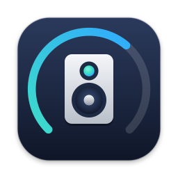
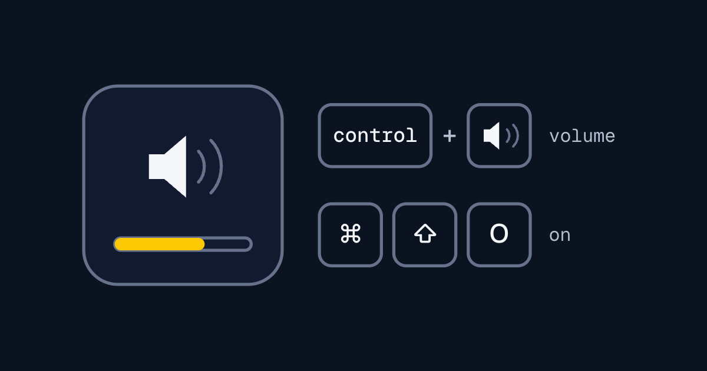

<p align="center">
  
</p>

# KEF Remote

A small macOS app that puts a KEF LSX speaker on your keyboard. Hold Control and press the volume keys, and the speaker's volume changes instead of the Mac's, with an on-screen display like the one macOS shows for its own volume. Cmd+Shift+O turns the speaker on, or off if it's on.



It runs in the background with no Dock icon. A small speaker icon in the menu bar shows whether it's connected to the speaker, and opens Settings.

This is an early release with real rough edges. Read [Known limitations](#known-limitations) before you install it.

## What's new in 0.2.0

- **Finds the speaker by itself.** It searches the network when it starts, and again if the speaker's IP changes. No Terminal step.
- **Auto or Manual discovery.** Settings shows the speaker it found and its IP. Choose Manual to type the IP yourself.
- **Menu bar menu.** Settings… and Quit, plus a settings window for the speaker's IP, the modifier key and the shortcuts.
- **Shows when it's connected.** A filled speaker icon and "Connected to LSX", or "Not connected" with the reason and a Find speaker item.
- **One power shortcut.** Cmd+Shift+O turns the speaker on or off, whichever it isn't.
- **Your own shortcuts.** Record new keys for power, volume up, volume down, mute and quit in Settings.
- **An app icon.**
- **Logging.** Each command, decision and failure writes one plain line to `~/.kef-remote/logs/kef-remote.log`.
- **Code quality.** Tests went from 97 to 173, and a review pass tidied names, comments and logging.

## Requirements

- macOS 14 (Sonoma) or later.
- A KEF LSX on the same network as your Mac.
- Accessibility permission, so the app can see the volume keys.

I've only tested it on an original LSX. The LS50 Wireless uses the same control protocol, so it may work, but I haven't tried one. Newer models such as the LSX II and LS50 Wireless II use a different control system and aren't supported.

## Install

### 1. Download

Download the zip from the [Releases](https://github.com/dileeparanawake/kef-remote/releases) page, unzip it by double-clicking it in Finder, and move `KEFRemote.app` to your Applications folder.

### 2. Open it the first time

#### macOS 15 (Sequoia) and later

1. Open `KEFRemote.app`. macOS says it wasn't opened. Click Done.
2. Open System Settings > Privacy & Security and scroll down to Security.
3. Click Open Anyway. It only shows for about an hour after the blocked open.
4. Enter your password, then click Open.

#### macOS 14 (Sonoma)

Control-click `KEFRemote.app` in Finder, choose Open, then click Open.

#### Any version, from Terminal

Remove the quarantine flag macOS adds to downloads, and it opens normally:

```sh
xattr -dr com.apple.quarantine /Applications/KEFRemote.app
```

You only need to do this once. If it says "No such xattr", the flag is already gone.

### 3. Allow local network access

On macOS 15 and later, macOS asks whether KEF Remote can find and connect to devices on your local network. Click Allow, or it can't find or reach the speaker. If you missed the prompt, turn it on in System Settings > Privacy & Security > Local Network.

### 4. Allow Accessibility

On first open, macOS asks to give KEF Remote Accessibility access. Open System Settings from the prompt and turn KEFRemote on under Privacy & Security > Accessibility.

Then quit KEF Remote (Cmd+Shift+Q) and open it again. It only starts listening for the volume keys at launch, so the permission takes effect after a restart.

### 5. Check it's connected

When it opens, KEF Remote looks for the speaker on your network and saves its IP. Click the speaker icon in the menu bar: it should say "Connected to LSX".

Then press Cmd+Shift+O to turn the speaker on, then Control + volume up: a small panel in the middle of the screen shows the volume.

If the menu says "Not connected", click Find speaker. If you've just allowed local network access, this is the fix.

### If it can't find the speaker

Set the IP by hand. Click the menu bar icon, choose Settings…, set Discovery to Manual under Speaker, type the speaker's IP and click Save. In Manual, KEF Remote uses that IP and never looks for the speaker by itself. Switch back to Auto to let it find the speaker again.

To find the IP, look in KEF's own app on your phone: it shows the speaker's IP in the speaker's settings while it's connected. Or open your router's admin page and look at its list of connected devices for one named LSX or KEF.

The IP and the discovery mode are saved in `~/.kef-remote/config.json`. A config file from 0.1.0 keeps working, with discovery on Auto.

## Shortcuts

| Shortcut | What it does |
|---|---|
| Control + Volume Up (F12) | Speaker volume up by 5 |
| Control + Volume Down (F11) | Speaker volume down by 5 |
| Control + Mute (F10) | Mute or unmute the speaker |
| Cmd + Shift + O | Turn the speaker on, or off if it's on |
| Cmd + Shift + Q | Quit KEF Remote |

If your function keys are set to work as standard F keys, hold Fn as well for the volume keys.

Cmd+Shift+Q is also the macOS shortcut for Log Out. While KEF Remote is running it should get the shortcut first. If macOS asks whether you want to log out instead, click Cancel and quit KEF Remote from Activity Monitor.

To use a different key from Control, or change the shortcuts, open Settings from the menu bar icon. To change a shortcut, click its field and press the new keys; Delete clears it. Volume up, volume down and mute have no shortcut until you record one. Changes apply straight away.

## Menu bar icon

The icon shows whether KEF Remote is connected to the speaker. It checks when it starts, and every key press updates it.

| Icon | Meaning |
|---|---|
| Filled speaker | Connected: the speaker answered |
| Speaker outline | Checking the speaker answers |
| Speaker with a warning badge | Not connected: the speaker didn't answer |
| Magnifying glass | Looking for the speaker |
| Speaker with a plus | No speaker set |
| Crossed-out speaker | Paused: not on the home network |

The menu's first line says "Connected to LSX" or "Not connected", with the IP or the reason under it. When it isn't connected, Find speaker looks for the speaker on the network and saves its IP. Settings… and Quit are below.

## Known limitations

| Limitation | What to do for now |
|---|---|
| Finding the speaker needs the Mac and the speaker on the same network, with local network access allowed. | Set the IP in Settings (see [If it can't find the speaker](#if-it-cant-find-the-speaker)). |
| It doesn't start at login. | Add it in System Settings > General > Login Items. |
| Fast repeated key presses can get lost. After an error, presses are ignored for about two seconds while it reconnects. | Press the keys one at a time. |
| After the Mac sleeps, the icon can still say connected until the next key press. | Press a volume key; the icon updates. |
| Turning the speaker on at wake and off at sleep is in the code, but off by default and untested. | Leave `powerOnWake` and `powerOffSleep` set to `false` in the config file. |

## Build from source

You'll need Xcode on macOS 14 or later.

1. Clone this repo and open `KEFRemote.xcodeproj` in Xcode.
2. In the KEFRemote target's Signing & Capabilities, choose your own team. If Xcode rejects the bundle identifier, change it to something unique.
3. Press Cmd+R to build and run.

Run the tests with:

```sh
swift test --disable-sandbox
```

There are 216 unit tests. They cover the protocol encoding, the volume and source bytes, the config file, the speaker commands against a mock connection, discovery against a mock socket, the menu bar's states and the log file. Everything that touches the real speaker, the keys or the display was tested by hand.

## How it works


The app talks to the speaker over TCP on port 50001, the protocol the KEF Control app uses. Volume and mute live in one register, and power, input and standby are packed into the bits of another.

To find the speaker, it sends an SSDP search (the same one UPnP devices answer) and reads each reply's description to pick out the KEF. It saves the IP, and searches again if the speaker stops answering there.

The code is a Swift package with three targets:

- **KEFRemoteCore**: the protocol, speaker commands, TCP connection, discovery, config and logging, with no UI.
- **KEFRemote**: the macOS app, with volume key interception, the on-screen display, the menu bar, settings and the shortcuts.
- **kef-discover**: runs discovery once and prints each step (`make discover`).

## Credits

- [KeyboardShortcuts](https://github.com/sindresorhus/KeyboardShortcuts) by Sindre Sorhus (MIT License), for the global shortcuts.
- [kefctl](https://github.com/kraih/kefctl), a Perl reference implementation (Artistic License 2.0), for the details of the KEF speaker protocol.

## Licence

MIT. See [LICENSE](LICENSE).
